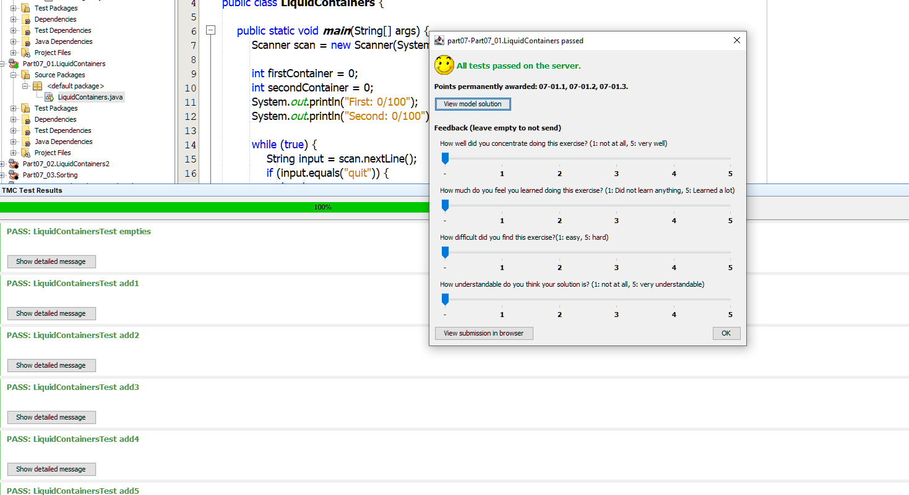

## As long as you've tried your best

At first when my Java lessons was still simple, straightforward and consisted of all easy exercises, I felt overwhelmingly satisfied with myself whenever I returned a solution to the TMC server and received the announcement that my solution had passed all test cases. The green marks on my screen and the statement "All tests passed on the server" filled me with pride and content, the naive feeling of a child when it successfully solves the very first math problem in its entire life "1 plus 1 equals 2". 

   

However that naive feeling would soon be replaced by a sour feeling of failing as the lessons and the exercises get harder and harder. Of course I do not expect that I would do it right every single time, yet failing is the bitter medicine to swallow. And I wouldn't have felt so embarassed and angry to myself if the errors had not been for my carelessness: sometimes they were caused by the lack of a semicolon, which could have been avoided if I had checked my code one last time before submitting, sometimes they were caused by the lack of...well...brain, and sometimes errors were the mystery of time which I did not know where it came from and how to get it fixed.  

Yet looking on the bright side, each failing leads me to a different land of knowledge which fruits will then be added to my basket of experience. Such as I know that if I want to have a value added up with the amount stated by users, I should declare it and assign it to 0 outside of the while loop instead of inside because everytime the while loop executes the value will be set to 0 again. 

```
int value = 0;
while (true) {
    System.out.print("Add to the value: ");
    int amount = Integer.valueOf(scan.nextLine());

    if (amount > 0) {
        value += amount;
    }
......
```

I've learnt to be patient when trying to untangle errors because sometimes things are not as straightforward as it seems, and it requires a bit of effort to research, Google searches, or JJ's. More importantly, I've learnt that there are cases when my solution is  
